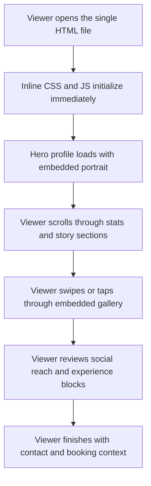

## 1. Product Overview
Create a single-file offline profile page for `Angela Andrist` that opens directly on iPhone and presents a polished, agency-ready talent profile without any network access.
- The page must be easy to hand off as one `.html` file, with all styling, behavior, and imagery embedded inside it.
- The deliverable supports client presentations, offline sharing, and quick review on mobile devices before any live deployment.

## 2. Core Features

### 2.1 User Roles
| Role | Registration Method | Core Permissions |
|------|---------------------|------------------|
| Viewer | None | Open the file locally, browse profile sections, view embedded images, and inspect talent details offline |

### 2.2 Feature Module
1. **Offline profile page**: hero card, identity summary, visual gallery, stats, experience, social reach, and contact framing
2. **Embedded media system**: compressed images stored as inline data URIs inside the HTML file
3. **Mobile interaction layer**: swipe-friendly gallery, tap targets sized for iPhone, sticky section access, and smooth in-page transitions

### 2.3 Page Details
| Page Name | Module Name | Feature description |
|-----------|-------------|---------------------|
| Angela Andrist Offline Profile | Intro hero | Displays name, role, location, profile image, and premium brand framing above the fold |
| Angela Andrist Offline Profile | Key facts | Shows concise measurements, profile attributes, and booking-ready details in stacked mobile cards |
| Angela Andrist Offline Profile | Gallery | Presents compressed embedded images with touch-friendly horizontal browsing and fullscreen-like focus behavior without external assets |
| Angela Andrist Offline Profile | Experience | Lists title, certifications, projects, or editorial highlights in a compact mobile timeline |
| Angela Andrist Offline Profile | Social reach | Summarizes platform presence and total reach using baked-in data blocks |
| Angela Andrist Offline Profile | Contact footer | Provides agency presentation framing and offline-safe CTA text without active network actions |

## 3. Core Process
The viewer receives one HTML file, opens it in Safari or any mobile browser, sees an editorial hero section immediately, scrolls through the baked profile content, swipes through the embedded gallery, and reviews the full profile offline without missing fonts, scripts, styles, or images.

## 4. User Interface Design
### 4.1 Design Style
- Primary colors: deep obsidian, warm ivory, muted champagne, and soft graphite
- Button style: rounded pill controls with subtle glass depth and tactile press states
- Font and sizes: refined editorial serif for headlines, readable humanist sans for body text, compact mobile hierarchy
- Layout style: mobile-first stacked cards with cinematic image framing and sticky mini-navigation
- Icon style suggestions: minimal line icons or typographic markers built with CSS only

### 4.2 Page Design Overview
| Page Name | Module Name | UI Elements |
|-----------|-------------|-------------|
| Angela Andrist Offline Profile | Intro hero | Full-width portrait crop, layered name lockup, compact metadata chips, soft gradients, fade-in entrance |
| Angela Andrist Offline Profile | Key facts | Two-column stat cards on wider phones, single-column stack on narrow screens, high-contrast labels |
| Angela Andrist Offline Profile | Gallery | Snap-scrolling cards, thumbnail indicators, gentle scale transitions, embedded image zoom panel |
| Angela Andrist Offline Profile | Experience | Vertical timeline cards with condensed spacing and timeline accents |
| Angela Andrist Offline Profile | Social reach | Bold numeric total, platform breakdown pills, subtle animated counters |
| Angela Andrist Offline Profile | Contact footer | Signature block, agency note, polished closing banner |

### 4.3 Responsiveness
- Mobile-first, optimized around iPhone widths from `375px` to `430px`
- Supports safe-area insets, thumb-friendly controls, reduced visual clutter, and readable portrait scrolling
- Gracefully expands on tablet and desktop while preserving the premium mobile composition

### 4.4 Content Assumptions
- The repository does not currently contain confirmed `Angela Andrist` profile data or clearly labeled Angela-specific image assets
- Implementation should therefore either use user-supplied Angela assets or a confirmed source profile before final baking
- The final HTML should be structured so profile text and image data URIs can be swapped without changing the layout system
