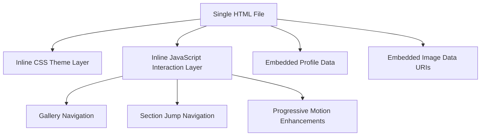
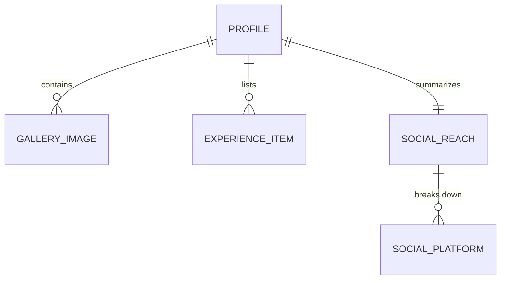

## 1. Architecture Design


## 2. Technology Description
- Frontend: semantic HTML5 + inline CSS3 + vanilla JavaScript
- Packaging: one self-contained `.html` file
- Assets: embedded `data:` URIs for compressed images, no external network dependencies
- Runtime: opens directly from disk on iPhone, desktop, or tablet browser

## 3. Route Definitions
| Route | Purpose |
|-------|---------|
| `offline file` | Opens the Angela Andrist profile locally without any server |

## 4. API Definitions
No backend APIs are required. All profile content is baked into the file.

```ts
type EmbeddedProfile = {
  name: string;
  roleLabel: string;
  location: string;
  intro: string;
  measurements: Array<{ label: string; value: string }>;
  highlights: string[];
  socialReach: {
    total: number;
    platforms: Array<{ name: string; handle: string; followers: number }>;
  };
  experience: Array<{
    kind: "TITLE" | "CERTIFICATION" | "PROJECT";
    title: string;
    role?: string;
    when?: string;
  }>;
  gallery: Array<{
    mimeType: string;
    dataUri: string;
    alt: string;
  }>;
};
```

## 5. Server Architecture Diagram
No server layer is used for this deliverable.

## 6. Data Model
### 6.1 Data Model Definition


### 6.2 Data Definition Language
No database DDL is required because the deliverable is a static baked file.

## 7. Implementation Decisions
- Output file path should be a single HTML artifact, preferably under `public/` for easy preview and export
- All CSS must be inline inside a single `<style>` block
- All JavaScript must be inline inside a single `<script>` block
- Images must be compressed before embedding to keep the HTML reasonably portable
- The page should use `meta viewport` with safe-area support and iPhone-friendly spacing
- Touch gestures are optional, but tap-based gallery navigation and snap scrolling are required
- If Angela-specific assets are unavailable, the build must pause for asset confirmation rather than fabricate identity-specific media
